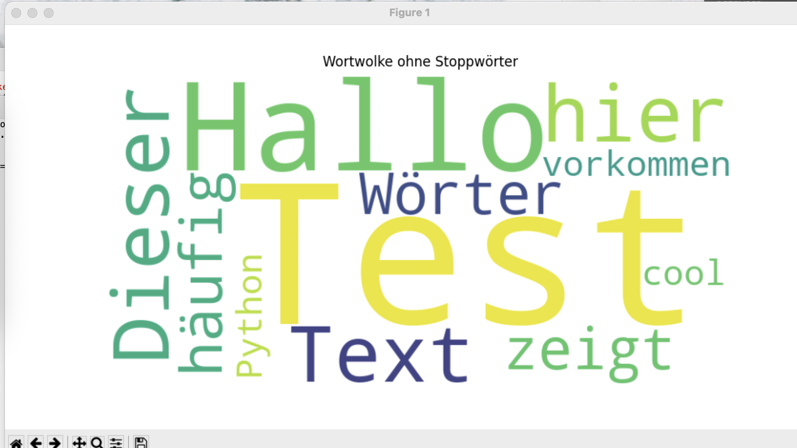

 README.md-Datei:

# Text-Analyzer mit Wortwolke

## Projektbeschreibung
Dieses Programm analysiert Textdateien und zeigt:  
1. Die **Top 10 häufigsten Wörter** (ohne Stoppwörter).  
2. Eine **visuelle Darstellung** der Wörter als Wortwolke.  

Das Programm wurde mit **Python** und den Bibliotheken **Pandas**, **Matplotlib**, **WordCloud** und **Tkinter** erstellt.

## Funktionen
- Benutzerfreundliche grafische Oberfläche (GUI) zur Dateiauswahl.  
- Analyse der Wörter in einer Textdatei.  
- Filterung von **Stoppwörtern** (z. B. der, die, das).  
- Anzeige der **Top 10 Wörter**.  
- Erstellung einer **Wortwolke** als visuelle Darstellung.  

## Technologien
- **Programmiersprache**: Python  
- **Bibliotheken**:  
   - Pandas: Datenverarbeitung  
   - Matplotlib: Grafiken anzeigen  
   - WordCloud: Wortwolke erstellen  
   - Tkinter: Benutzeroberfläche  

## Installation und Ausführung
1. Stelle sicher, dass **Python** installiert ist.  
2. Installiere die benötigten Bibliotheken:  
   ```bash
   pip install pandas matplotlib wordcloud tk

3. Führe das Programm aus: 

Python3 text_analyzer.py

## Beispiel-Screenshot


